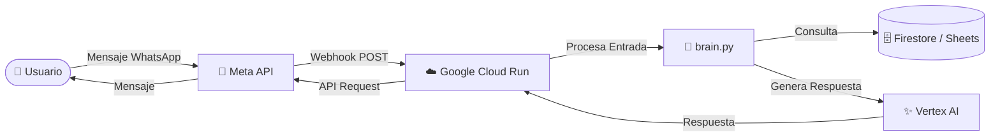

# 🤖 AutoBot: Tu Asistente de Ventas en WhatsApp


AutoBot es un asistente virtual inteligente diseñado para WhatsApp, capaz de gestionar inventarios de autos, responder consultas de clientes y mantener conversaciones naturales gracias a la IA de Google Vertex AI (Gemini).

## 🏛️ Arquitectura

El proyecto sigue una arquitectura **Serverless** y plana para facilitar el despliegue en Google Cloud Run usando Buildpacks.

- **`main.py`**: Punto de entrada (Entry Point). Gestiona el Webhook de WhatsApp (verificación y recepción de mensajes) y la respuesta HTTP.
- **`brain.py`**: Contiene la lógica de negocio ("Cerebro"). Integra Vertex AI, maneja el historial de conversación y consulta la base de datos (Firestore/Sheets).
- **`config.py`**: Centraliza la configuración, variables de entorno y prompts del sistema.
- **`requirements.txt`**: Lista de dependencias de Python.

### 🔄 Flujo de Datos



## 🛠️ Guía de Configuración

Para desplegar este bot, necesitas configurar las siguientes variables de entorno en Google Cloud Run y conectar el Webhook en el panel de desarrolladores de Meta.

### 1. Variables de Entorno

Copia el archivo `.env.template` a `.env` (para desarrollo local) o configúralas directamente en Cloud Run.

| Variable | Descripción |
| :--- | :--- |
| `GCP_PROJECT` | ID de tu proyecto en Google Cloud. |
| `VERIFY_TOKEN` | Token secreto que tú inventas para verificar el Webhook en Meta. |
| `WHATSAPP_TOKEN` | Token de acceso (Permanent Access Token) de la API de WhatsApp. |
| `PHONE_NUMBER_ID` | ID del número de teléfono en WhatsApp Business API. |
| `SPREADSHEET_ID` | ID de la hoja de Google Sheets con el inventario (si aplica). |
| `LOCATION` | Región de Google Cloud (ej. `us-central1`). |

### 2. Configuración del Webhook (Meta)

1. Ve a [Meta for Developers](https://developers.facebook.com/).
2. En tu App, ve a **WhatsApp > Configuration**.
3. En **Callback URL**, ingresa la URL de tu servicio Cloud Run (ej. `https://autobot-xyz.a.run.app`).
4. En **Verify Token**, ingresa el mismo valor que pusiste en la variable `VERIFY_TOKEN`.
5. Suscríbete al evento `messages`.

## 🚀 Despliegue

El despliegue es automático gracias a Google Cloud Buildpacks. No necesitas Dockerfile.

```bash
# Autentícate en Google Cloud
gcloud auth login

# Despliega en Cloud Run (desde la raíz del proyecto)
gcloud run deploy autobot \
  --source . \
  --region us-central1 \
  --allow-unauthenticated \
  --set-env-vars VERIFY_TOKEN=tu_token_secreto,WHATSAPP_TOKEN=...,...
```

---

*Desarrollado con ❤️ y Python.*
